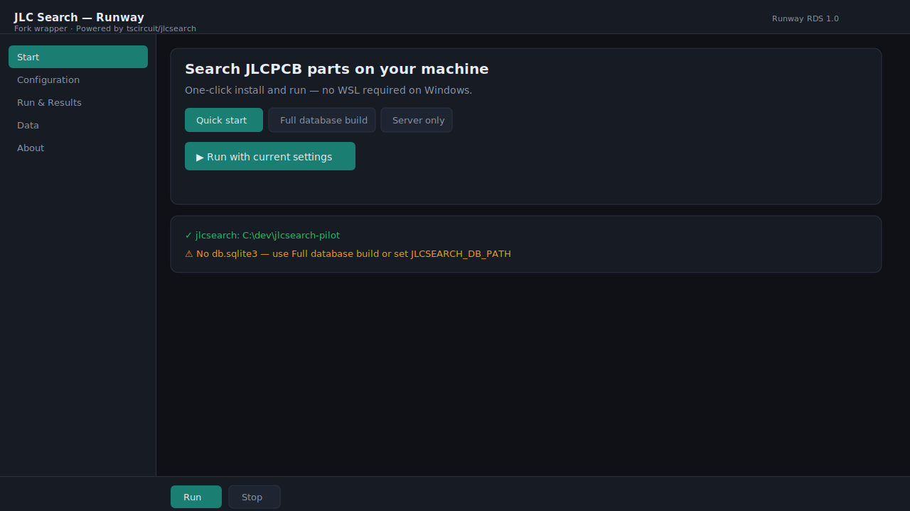
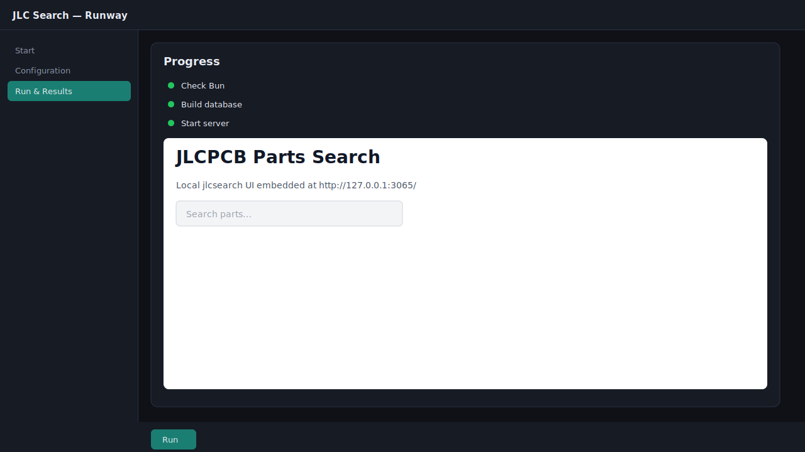

# JLC Search — Runway

[](https://bun.com)
[](LICENSE)
[](https://github.com/tscircuit/jlcsearch)

One-click visual wrapper for [tscircuit/jlcsearch](https://github.com/tscircuit/jlcsearch). Run the JLCPCB parts search engine locally on Windows **without WSL**.

> **Not an official tscircuit product.** Independent UI wrapper by [@thienanwspace](https://github.com/thienanwspace).

## Screenshots

| Start — pick a preset and run | Run & Results — embedded jlcsearch |
|---|---|
|  |  |

Replace with live PNGs anytime: `bun run screenshots` (requires Chrome/Edge + local servers).

## Why Runway?

| Without Runway | With Runway |
|----------------|-------------|
| Read dev README, install deps manually | One-click launcher |
| Remember env vars and ports | Visual presets + command preview |
| Terminal-only logs | Progress steps + embedded app |

## Requirements

- [Bun](https://bun.com) >= 1.2.0
- A clone of [jlcsearch](https://github.com/tscircuit/jlcsearch) with dependencies installed
- **Do not** install `node_modules` inside OneDrive (Files On-Demand leaves empty placeholders)

## Quick start

```powershell
# 1. Clone jlcsearch outside OneDrive (recommended)
git clone --depth 1 https://github.com/tscircuit/jlcsearch.git C:\dev\jlcsearch-pilot
cd C:\dev\jlcsearch-pilot
bun install --ignore-scripts
bun add zod format-si-unit

# 2. Clone and run Runway
git clone https://github.com/thienanwspace/runway-jlcsearch.git
cd runway-jlcsearch
.\scripts\runway-start.ps1
```

Open **http://127.0.0.1:3080/** → click **Run**.

## Configuration

| Variable | Description |
|----------|-------------|
| `JLCSEARCH_ROOT` | Path to your jlcsearch clone |
| `JLCSEARCH_DB_PATH` | Path to `db.sqlite3` (optional) |
| `RUNWAY_PORT` | Runway UI port (default `3080`) |

## Presets

- **Quick start** — skip DB build, start server (homepage works; search needs a database)
- **Full database build** — download jlcparts cache and build DB (~2GB; Windows may need 7zip patch)
- **Server only** — assumes `db.sqlite3` already exists

## Ports

| Service | Default |
|---------|---------|
| Runway UI | 3080 |
| jlcsearch | 3065 |

## Architecture

```
runway-jlcsearch/          ← this repo (Runway RDS shell)
  ui/                      ← static English UI
  server.ts                ← API + SSE job runner
  lib/runner.ts            ← spawns jlcsearch

../jlcsearch-pilot/        ← upstream app (separate clone)
  db.sqlite3               ← optional ~2GB parts database
```

## Scripts

| Command | Description |
|---------|-------------|
| `bun run start` | Start Runway UI server |
| `bun run screenshots` | Capture PNGs into `docs/screenshots/` |
| `.\scripts\runway-start.ps1` | One-click: open browser + start server |

## License

MIT (this wrapper). Upstream [jlcsearch](https://github.com/tscircuit/jlcsearch) is MIT by tscircuit.